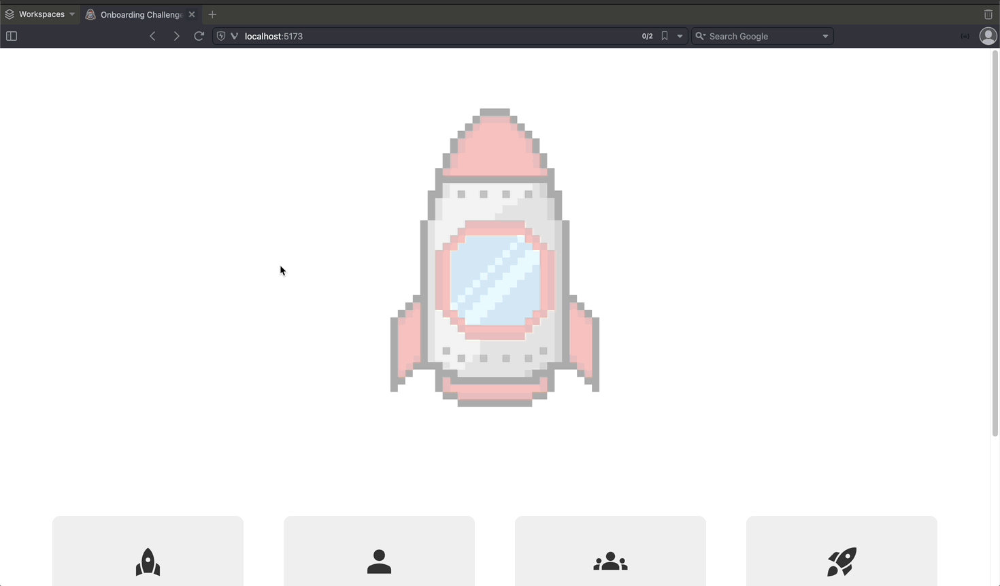

# 🚀 Rocket Launch System

<div align="left">
    
    
    
    
</div>

---

## Plank Fellowship Program's Onboarding Challenge

The Rocket Launch Control System is a project designed during the Plank Fellowship Program to emulate the control and management of rocket launches. It provides functionality for handling rockets, launches, crews, and crew members. This system aims to simulate the various aspects involved in preparing and executing a rocket launch.

You can try it here: [Onboarding Challenge](https://onboarding-challenge-frontend.vercel.app)

[](https://onboarding-challenge-frontend.vercel.app)

## Features

The rocket caunch control system offers the following features:

1. **Rocket Management:** The system allows you to create, update, and delete rocket details. You can track information such as the rocket's name.

2. **Crew Member (crewman) Management:** This system allows you to create and maintain a database of crew members. You can store information such as their names and patent. Crew members can be assigned to different crews for specific launches.

3. **Crew Management:** The system enables you to create and manage crews to be asigned to specific launches. Each crew can have multiple crew members, and their roles and responsibilities can be defined.

4. **Launch Management:** With this system, you can register and manage rocket launches. You can set the launch date, rocket, crew and launch status.

## Usage

To use the Rocket Launch Control System, follow the steps outlined below:

1. Clone the repository:

	```shell
	$ git clone https://github.com/nandercarmo-plank/onboarding-challenge-frontend.git
	```

2. Enter in the project directory

	```shell
	$ cd onboarding-challenge-frontend
	```

3. Install the project dependencies:

	```shell
	$ npm install
	```

	or

	```shell
	$ yarn install
	```

4. Start the development server:

	```shell
	$ npm run dev
	```

	or

	```shell
	$ yarn dev
	```

5. Access the application in your browser at [`http://localhost:3000`](http://localhost:3000).

6. Use the provided interface to interact with the Rocket Launch Control System. You can create rockets, schedule launches, manage crews, and assign crew members to rockets and launches.

## Available Scripts

The project includes several scripts that you can use during development:

- `build`: Build the project to production using Vite.

- `dev`: Starts the development server using Vite.

- `tests`: Runs tests using Jest.

- `tests-watch`: Runs tests in watch mode using Jest.

- `lint`: Runs the ESLint linter on the source code files.

- `storybook`: Starts the Storybook development server.

The Rocket Launch Control System provides a foundation for simulating the control and management of rocket launches. It can be extended and customized to meet specific requirements and integrate with other systems. Happy rocket launching!